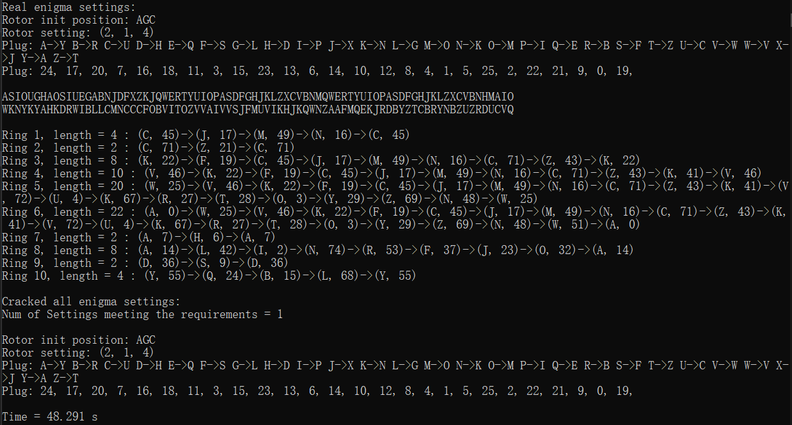

## 密码学基础第一次作业

2018013443	陈新	计82

### Enigma

三个转子的Enigma密码机

给出一对明密文对，使用已知明文攻击的方法来恢复密钥

#### 原理

$y = Encrypt(x) = S^{-1}N^{-1}M^{-1}L^{-1}RLMNS(x)$

记 $P = N^{-1}M^{-1}L^{-1}RLMN$

并且由于S插线板是对称的，因此 
$$
\begin{align}
Encrypt^2(x) &= Encrypt(y) \\
&= S^{-1}N^{-1}M^{-1}L^{-1}RLMNSS^{-1}N^{-1}M^{-1}L^{-1}RLMNS(x) \\
&= S^{-1}N^{-1}M^{-1}L^{-1}RLMNN^{-1}M^{-1}L^{-1}RLMNS(x) \\
&= S^{-1}PPS(x) \\
即Encrypt^n(x) &= S^{-1} P^n S(x)
\end{align}
$$
也就是说，一个字符经过多次连续加密，仅相当于在开头和结束时过一次插线板。

如果找到一个字符加密的序列，使得加密（每次加密前需要调整转子位置）完仍为原字符，即 $Encrypt^n(x) == x$ ，则有 $x == S^{-1} P^n S(x) => S(x) == P^n S(x)$ 

遍历 $G = S(x)$ 为26个字母，经过n次不带插线板的加密序列仍为 $G$，则可以认为实际插线板 $G<=>x$ 是一种可能情况。

因此，对于已知明文攻击，只需要遍历rotor的选取、转子初始位置，构造出enigma机器，并测试所有明密文对里的“加密回到原字符的圈”，并测试是否能够通过插线板连接 $G$ 和 $S(x)$ ，即可得出可能的所有enigma配置

这样一来尽管rotor选取、转子初始位置仍然需要穷举，但避免了对于插线板的穷举。原本需要26个字母中选取10对字母，现在仅需要$\times26$即可

#### 代码解读

代码为项目`Enigma`

主要破解逻辑位于`enigma.h`的`Crack`函数

（crack代码中完全随机化rotor、初始转子位置、插线板配置、明密文对，可以正确破解出所有可能的enigma配置。运行项目并输入1即可破解随机配置）

首先调用`findRings`函数找到明密文对里的所有圈（不包括重复元素）

然后找出每个字母分别在多少个圈里出现，并按照出现次数降序排列。因为出现在更多圈里的字母，其插线板连接就要与更多集合做交集处理，可能性就越少。优先将确定性的字母找出来能剪枝（经测试比顺序寻找快了4至5倍）

然后穷举rotor选取、转子初始位置并构造enigma机器，并对每个配置进行如下检测：

对于每个ring，测试`G='A'-'Z'`能否通过ring的加密变回`G`。如果不能则舍弃，如果能则添加一对plug。如果与前面的ring添加的plug冲突，则舍弃。通过了全部检测的即为一种可能的密钥配置

在`crack.cpp`中，我完全随机选取rotor、转子初始位置、插线板，并且随机了一对长度为 $80$ 的明密文对进行破译。由于完全随机性以及明密文长度过短导致的某些插线板的配置不影响加密结果，从而导致有些情况会产生多于一种可能解，如：

#### 破解样例

运行项目，输入2即可查看验证过程

------------------

### 书后题目

书后题目的代码也在目录下，请自行查看

#### 1.5

代码为 `chapter1_1.5.cpp`

将每个字母向右移k位后输出，遍历k=0,1,...,25

从decode出的明文中找出有正确语义的即可

从图中可以看出，解密时右移10个字母，即密钥为左移10个字母时，有明确语义，其明文为

LOOKUPINTHEAIRITSABRIDITSAPLANEITSASUPERMAN

Look up in the sky. It's a bird. It's a plane. It's superman. 

#### 1.16

(a)

先将原置换的$x$和$\pi(x)$互换

| $\pi(x)$ | 4    | 1    | 6    | 2    | 7    | 3    | 8    | 5    |
| -------- | ---- | ---- | ---- | ---- | ---- | ---- | ---- | ---- |
| $x$      | 1    | 2    | 3    | 4    | 5    | 6    | 7    | 8    |

整理得

| $x$           | 1    | 2    | 3    | 4    | 5    | 6    | 7    | 8    |
| ------------- | ---- | ---- | ---- | ---- | ---- | ---- | ---- | ---- |
| $\pi^{-1}(x)$ | 2    | 4    | 6    | 1    | 8    | 3    | 5    | 7    |

(b)

代码为 `chapter1_1.16.cpp`

将密文分为8个一组，明文的$x$位置就是密文的$\pi(x)$位置，进行置换

得出结果为

GENTLEMENDONOTREADEACHOTHERSMAIL

Gentlemen do not read each other's mail. 

#### 1.21

(a)

代码见 `chapter1_1.21_a.cpp/Frequency.h`

首先对单字频率进行统计，图中左侧为实际的字母使用频率，右侧为对密文的统计频率

C在密文中出现的频率最高，猜测E->C

又有提示W->F

文章中出现3次FZCCN，明文为W-EE-，猜测其为WHEEL，则H->Z, L->N

则已经得知ZC->HE。根据语言特点，THE的频率在三字组中应该很高

文中出现：

KZC：1次

FCZ：3次

SZC：1次

UZC：2次

又因为已知W->F，因此猜测T->U

现在的明密文对照为

观察到HEL*->ZCNX，则猜测P->X

观察到明文的WT部分，一般认为这两个辅音字母不会出现在一个单词的相邻位置，因此认为WT分属两个单词，T*->US，猜测O->S

从THE O*E WHEEL看出，ONE->SOC，即N->O

从NOT *E 猜测BE->DC，即B->D

从NOT BE *BLE TO看出ABLE->GDNC，即A->G

同理以此类推，一步步猜词，最终解密得：

IMAYNOTBEABLETOGROWFLOWERSBUTMYGARDENPRODUCESJUSTASMANYDEADLEAVESOLDOVERSHOESPIECESOFROPEANDBUSHELSOFDEADGRASSASANYBODYSANDTODAYIBOUGHTAWHEELBARROWTOHELPINCLEARINGITUPIHAVEALWAYSLOVEDANDRESPECTEDTHEWHEELBARROWITISTHEONEWHEELEDVEHICLEOFWHICHIAMPERFECTMASTER

即：

I may not be able to grow flowers, but my garden produces just as many dead leaves, old over shoes, pieces of rope and bushels of dead grass as anybody's. And today I bought a wheel barrow to help in clearing it up. I have always loved and respected the wheel barrow. It is the one-wheeled vehicle of which I am perfect master.

(b)

代码见 `chapter1_1.21_b.cpp/Vigenere.h/Frequency.h`

先找出出现次数最多的三元子串，为`HJV`

用Kasiski测试法考察子串`HJV`，计算出`HJV`子串的位置差值的最大公因子为6，则认为m=6

用指数重合法验证得`Ic`均值=0.0795

与0.065相差有些大，对m=6存疑，如若破解不出来换别的m

对 $i=0, 1, 2, 3, 4, 5$ 分别计算 $Mg=\sum_{i=0}^{25} \frac{p_i f_{i+g}} {n'}$ ，并对每组Mg取最大值

则计算结果如下6图

因此猜测密钥为K= (2, 17, 24, 15, 19, 14)

解密得：

ILEARNEDHOWTOCALCULATETHEAMOUNTOFPAPERNEEDEDFORAROOMWHENIWASATSCHOOLYOUMULTIPLYTHESQUAREFOOTAGEOFTHEWALLSBYTHECUBICCONTENTSOFTHEFLOORANDCEILINGCOMBINEDANDDOUBLEITYOUTHENALLOWHALFTHETOTALFOROPENINGSSUCHASWINDOWSANDDOORSTHENYOUALLOWTHEOTHERHALFFORMATCHINGTHEPATTERNTHENYOUDOUBLETHEWHOLETHINGAGAINTOGIVEAMARGINOFERRORANDTHENYOUORDERTHEPAPER

即：

I learned how to calculate the amount of paper needed for a room when I was at school. You multiply the square footage of the walls by the cubic contents of the floor and ceiling combined and double it. You then allow half the total for openings such as windows and doors then you allow the other half for matching the pattern. Then you double the whole thing again to give a margin of error and then you order the paper. 

(c)

代码见 `chapter1_1.21_c.cpp/Affine.h/Frequency.h`

首先分析单字频率

可以看出有E->C，则 $4a+b \equiv 2 \mod 26, a \neq 0, 2, 13$

猜测T->B，则 $19a + b \equiv 1 \mod 26$

解得 $a=19, b=4$

decode过程： $P \equiv a^{-1}(C-b) \mod 26$

解密得：

OCANADATERREDENOSAIEUXTONFRONTESTCEINTDEFLEURONSGLORIEUXCARTONBRASSAITPORTERLEPEEILSAITPORTERLACROIXTONHISTOIREESTUNEEPOPEEDESPLUSBRILLANTSEXPLOITSETTAVALEURDEFOITREMPEEPROTEGERANOSFOYERSETNOSDROITS

即：

O Canada terre de nos aieux ton front est ceint defleurons glorieux car ton bras sait porter lepee il sait porter la croix ton histoire est une epopee des plus brillants exploits et ta valeur de foi trempee protegera nos foyers et nos droits

(d)

代码见  `chapter1_1.21_d.cpp/Vigenere.h/Frequency.h`

首先猜测Vigenere密码

由于三元组、四元组都最多只有2个，因此难以通过Kasiski法判断m

用重合指数法

尝试可知在10以内，m=6, 8, 9, 10都是可能的

先尝试m=6

与(b)同理，计算Mg

i=1至5的图略

由此猜测密钥K=(19, 7, 4, 14, 17, 24)

解密得：

IGREWUPAMONGSLOWTALKERSMENINPARTICULARWHODROPPEDWORDSAFEWATATIMELIKEBEANSINAHILLANDWHENIGOTTOMINNEAPOLISWHEREPEOPLETOOKALAKEWOBEGONCOMMATOMEANTHEENDOFASTORYICOULDNTSPEAKAWHOLESENTENCEINCOMPANYANDWASCONSIDEREDNOTTOOBRIAHTSOIENROLLEDINASPEECHCOUQSETAUGHTBYORVILLESANDTHEFOUNDEROFREFLEXIVERELAXOLOGYASELFHYPNOTICTECHNIQUETHATENABLEDAPERSONTOSPEAKUPTOTHREEHUNDREDWORDSPERMINUTE

即：

I grew up among slow talkers men in particular who dropped words a few at a time like beans in a hill. And when I got to Minneapolis where people took a lake wobegon comma to mean the end of a story, I couldn’t speak a whole sentence in company and was considered not too briaht. So I enrolled in a speech couqse taught by Orvilles and the founder of reflexive relaxology, a self hypnotic technique that enabled a person to speak up to three hundred words per minute.

（按照英语语义理解，briaht和couqse感觉是bright和course，但没找出问题在哪……）

#### 1.26

(a)

已知m和n，只需要逆过程，将密文从上往下、从左往右地填写到m*n矩阵中，并从左往右、从上往下读出，就得到了明文

(b)

代码见 `chapter1_1.26.cpp`

密文长度为42

若n=1或m=1，则明文=密文。如果此题的密文=明文，就没有明显的语义，因此忽略该情况

只需要满足$42|n, 42|m, mn<=42$即可

一共有12种可能：

m=2, n=3, 分7组

m=3, n=2, 分7组

m=2, n=7, 分3组

m=7, n=2, 分3组

m=3, n=7, 分2组

m=7, n=3, 分2组

m=2, n=21

m=21, n=2

m=3, n=14

m=14, n=3

m=7, n=6

m=6, n=7

即

$m=2, n\in\{3, 7, 21\}$

$m=3, n\in\{2, 7, 14\}$

$m=7, n\in\{2, 3, 6\}$

$m=6, n=7$

$m=14, n=3$

$m=21, n=2$

分别进行尝试

可以看出m=2, n=3时，明文有正确语义

MARYMARYQUITECONTRARYHOWDOESYOURGARDENGROW

Mary, Mary, quite contrary. How does your garden grow? 

