## 密码学基础第二次作业

2018013443	陈新	计82

### 优化细节

#### CBC模式的AES_128

`CBC模式`：

padding模式选择为，填充“最后一个block的字节数（1-16）”（若刚好满16字节则增加一个block填充16个16）。每个block加密之前与前一个block异或

`AES_128`：

进行了一定优化。

将state和expansiveKey的行列号交换，则对于word为单位的操作从4个同一列bytes变为同一行，地址连续化。（行位移、列混合实际上变成列位移、行混合）

字节代换过程的Sbox、逆Sbox打表，直接查询即可。将for循环展开，加速效果明显

行位移环节，由于我颠倒了行列，变为列位移。故无法简单实用位移运算，因此副作用就是该环节慢一些（但同时，化为`uint64_t/unsigned __int128`用位移运算也会使得结果受计算机架构大小端影响，因此为了兼容正确性我认为也不应该这么做）

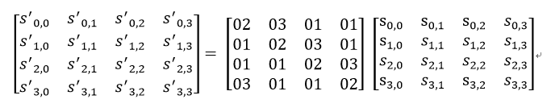

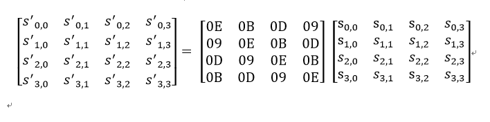

由于在（逆）列（行）混合环节内，数域内乘法有一项必定属于 `{ 0x01, 0x02, 0x03, 0x09, 0x0b, 0x0d, 0x0e }` ，因此只需将这7个数与256个数相乘的结果打表，即可加速乘法环节。将矩阵运算式不用for循环全部展开，加速效果明显

轮密钥加环节无优化空间

解密时，对每个block用openmp多线程分别用系列逆操作解密，再进行后面的异或、确定长度等操作

解密约为加密的5倍，不足核数6，一方面因为不是所有操作都能并行，一方面因为在加密过程中列混合的GF域乘法有`0x01 * uint8_t`的项，这一项数字不变因此可以不必查表，相较于解密每项都要查表快一些

#### RC4

按照算法实现即可达到速度指标，无特别优化

#### SHA3-256

置换环节打表

并在每个环节展开循环

### 最终性能

（可执行文件  Encryption/Encryption/Encryption.exe）

机器配置：笔记本 i9-8950HK（6核）

开启O0优化

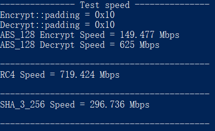

开启O1/O2优化差不多

O1：

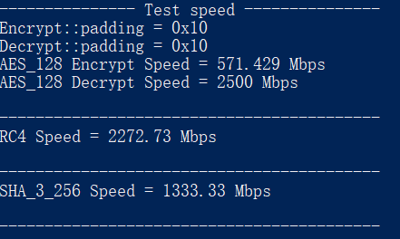

O2：

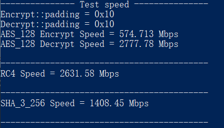

### 测试案例

（以下文件存储若非特殊说明，均以二进制存储）

（在本地文件自动存储了每次运行随机生成、加密/hash的16Kb数据，以供检验）

##### AES128

随机生成IV存在`AES_128_IV.in`，明文16Kb数据存在`AES_128.in`，加密结果存在`AES_128.out`

固定测例为 https://www.cryptool.org/en/cto/aes-step-by-step 网站的样例

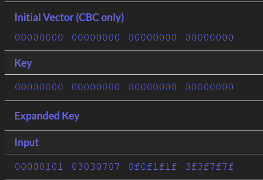

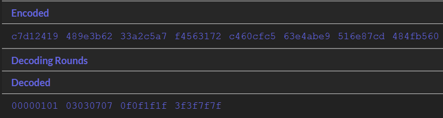

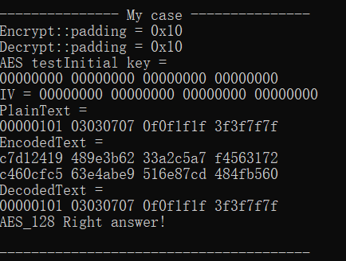

##### RC4

随机生成的128字节初始密钥存在`RC4_initKey.in`，生成的16Kb流密钥存在`RC4_key.out`，随机生成的16Kb明文数据存在`RC4.in`，加密结果存在`RC4.out`

固定测例为：

（利用 http://rc4.online-domain-tools.com/ 网站的RC4验证正确性）

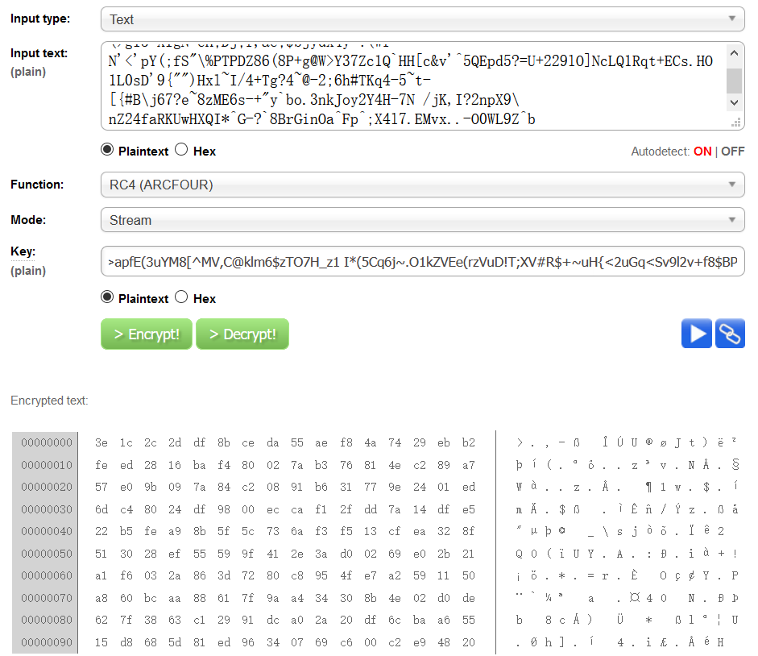

正确输出存在`RC4_caseright.out`，并进行比较

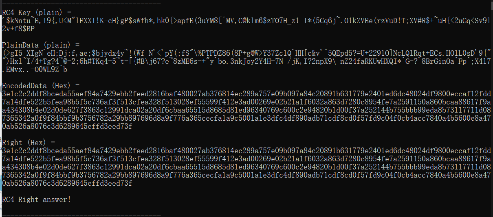

##### SHA3-256

随机生成的16Kb明文数据存在`SHA_3_256.in`，hash结果存在`SHA_3_256.out`，用python的hashlib库对`SHA_3_256.in`作hash，得到的hash值存在`SHA_3_256_right.in`，检验得均相等

（运行时需要python的hashlib库环境）

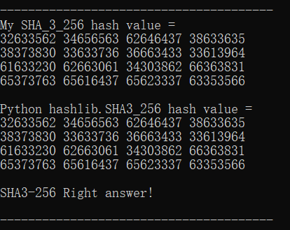