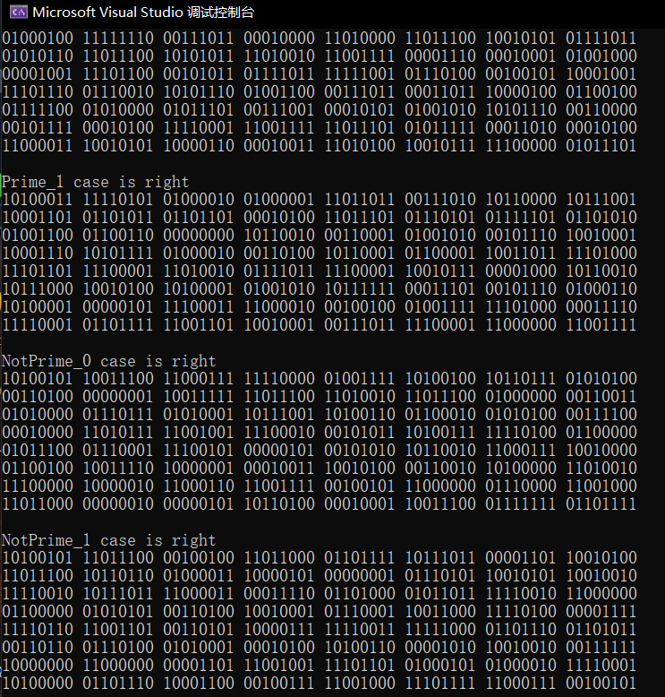
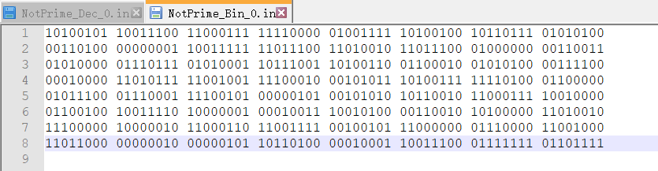
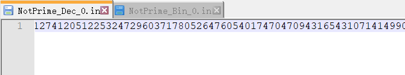

## 密码学基础第三次作业

2018013443	陈新	计82

### 实现

#### 大整数部分

本来实现大整数的话，封装一个vector+位数冗余会非常简单，但当时最初的想法就是写紧凑的`uint512_t/uint1024_t`（分别由8/16个`uint64_t`封装而成），好处在于长度确定，存储、通讯简单；也许在于可以复用。

当我刚写完`uint512_t`的时候，发现仅用512位的话，乘法溢出会导致函数值错误，在mod n之前相当于先mod 1 << 512，因此会导致计算错误，就必须实现1024位的`uint1024_t`用作乘法的中继变量。这时候就意识到扩展性不如封装vector，但还是就这么写完了。

实现了512位、1024位的大整数，及其位移运算、加减乘除运算、取模运算、位运算、自增自减

由于乘除法较难直接实现，采用快速乘法（即分解为二次幂加减法），因此每一次乘除法需要上千次运算，效率较低。取余则与除法过程相同，最终数据是余数而非商

求幂过程同样采取快速幂

随机数生成过程利用`rand()`，该函数范围为$[0, 32768)$，即随机的15位整数。因此$64=4*15+4$分为5个部分分别用随机数填充即可。最后将最高位、最低位置为1，则满足题目要求

#### MillerRabin算法

对每个待检测的整数n，将其化为$n = m \times 2^s$的形式

需要选择若干个素数，对于每个素数p，先计算$y \equiv p^m \ mod \ n$

然后重复s次：计算$y^* \equiv y^2 \ mod \ n$，若$y^* \equiv 1, y \ne 1和n-1 \ mod \ n$则判定为合数并终止，否则$y^* = y$迭代计算

最终若$y \ne 1 \ mod \ n$，则表明n为合数

检测完所有选定的素数，则表明n大概率为素数。选的检测素数个数越多，概率越大。我选择了从2开始的前50个素数，因此速度较慢

### 运行结果

### 数据

512位非负整数，保证最高位和最低位为1

以文本形式存储在`Prime_Bin_x.in/Prime_Dec.in`以及`NotPrime_Bin_x.in/NotPrime_Dec.in`中，x为非负整数

其中

`Prime`表示内部数据为质数，`NotPrime`表示内部数据为合数

`Bin`表示以文本形式存储二进制数据（为了增强可读性带空格、换行），`Dec`表示以文本形式存储十进制数据（用python大整数转换的）

例如：

